# 📱 SimpsonsApp

Aplicación móvil desarrollada con Expo y React Native que utiliza Firebase para autenticación.

---

## 🚀 Tecnologías utilizadas

- Expo
- React Native
- Firebase
- Firebase Authentication

---

## 📡 API Pública Utilizada


Este proyecto consume datos de **The Simpsons API**, una fuente gratuita de información del universo de _Los Simpson_ que no requiere autenticación.  
Los endpoints disponibles permiten obtener:

- 🧍 Personajes (nombre, edad, frases, imagen)
- 📍 Ubicaciones dentro de Springfield

```bash
Personajes: "https://thesimpsonsapi.com/api/characters"

Episodios: "https://thesimpsonsapi.com/api/episodes"

Ubicaciones: "https://thesimpsonsapi.com/api/locations"
```

En esta aplicación solo se usó Personajes, Ubicaciones.

---

## 📦 Instalación

Clonar el repositorio:

```bash
git clone https://github.com/marinosu/simpsonsapp.git
cd simpsonsapp
```

## ▶️ Ejecutar la aplicación con Expo Go

<!-- 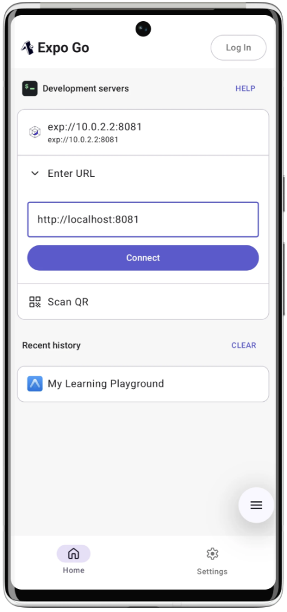 -->


La aplicación fue desarrollada con Expo y puede ejecutarse fácilmente en dispositivos móviles utilizando Expo Go.

1️⃣ Instalar dependencias

```bash
npm install
```

2️⃣ Iniciar el servidor de desarrollo

```bash
npx expo start
```

Este comando iniciará el servidor Metro Bundler y mostrará un código QR en la terminal o en el navegador.

3️⃣ Ejecutar en dispositivo físico (Android o iOS)

1. Descargar Expo Go desde:

- Google Play Store (Android)

- App Store (iOS)

2. Abrir la aplicación Expo Go en el dispositivo.

3. Escanear el código QR que aparece en la terminal o en el navegador.

4. La app se cargará automáticamente en el dispositivo.

💻 Opciones adicionales desde la terminal

```bash
a  # Abrir en emulador Android
i  # Abrir en simulador iOS (solo macOS)
w  # Abrir en navegador web
```

🧹 Limpiar caché (si ocurre algún error)

```bash
npx expo start -c
```

## 📷 Capturas de pantalla

Las capturas de pantallas se encuentran en la carpeta assets/screenshots/

# Inicio App
<!-- 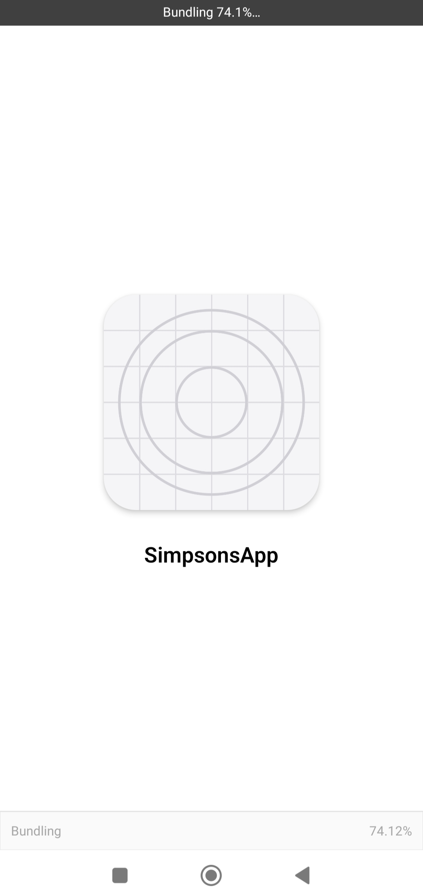 -->


# Pantalla Login
<!-- 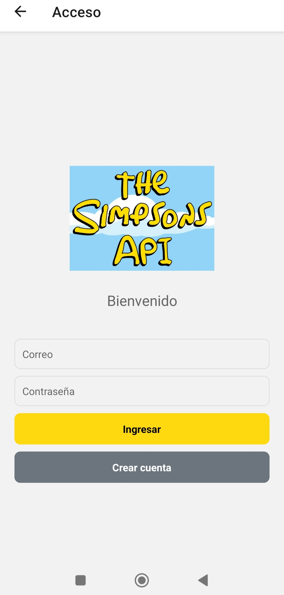 -->


# Pantalla Registro
<!-- 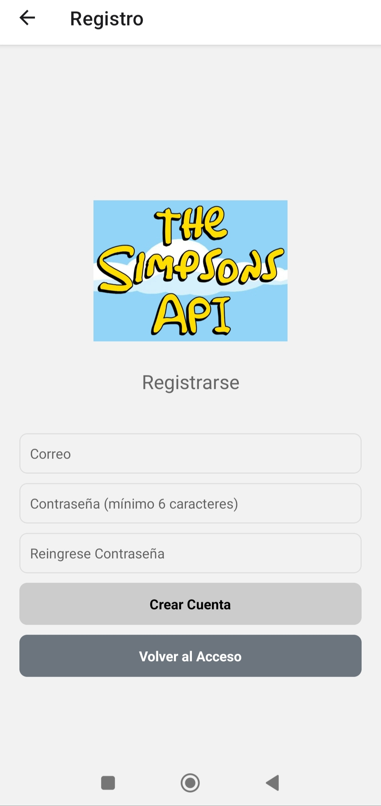 -->


# Sección de Personajes Simpsons
<!-- 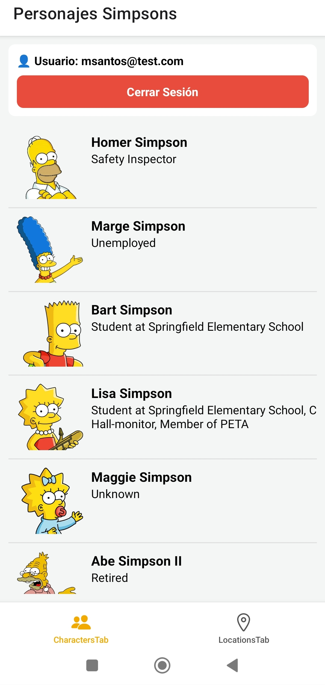 -->


<!-- 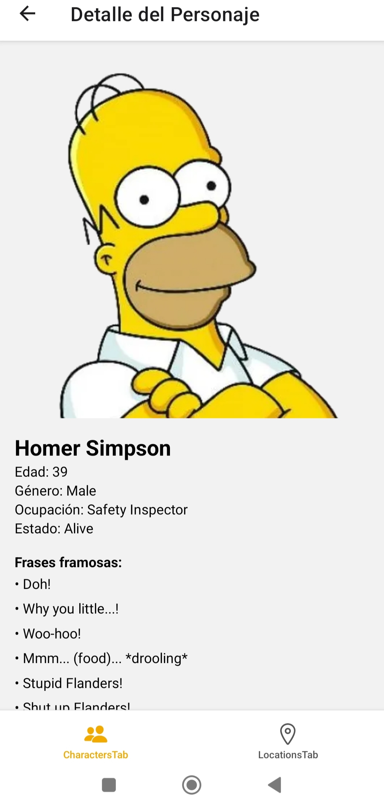 -->


<!-- 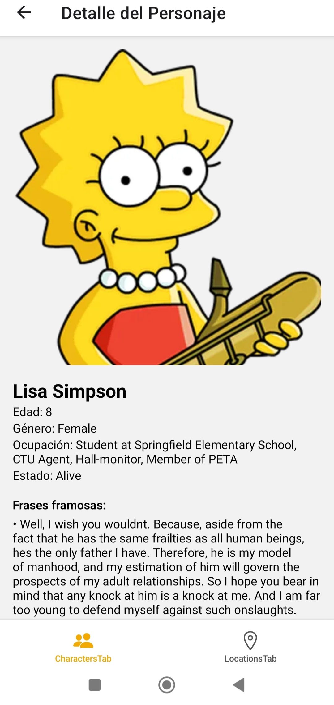 -->


# Sección de Ubicaciones Simpsons
<!-- 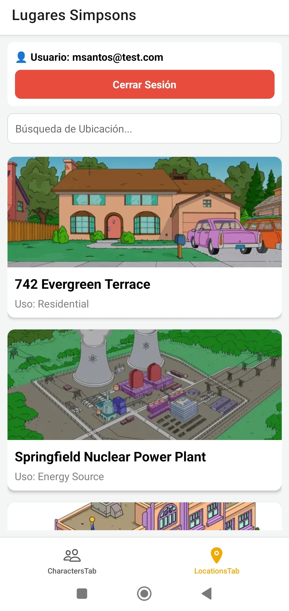 -->


<!-- 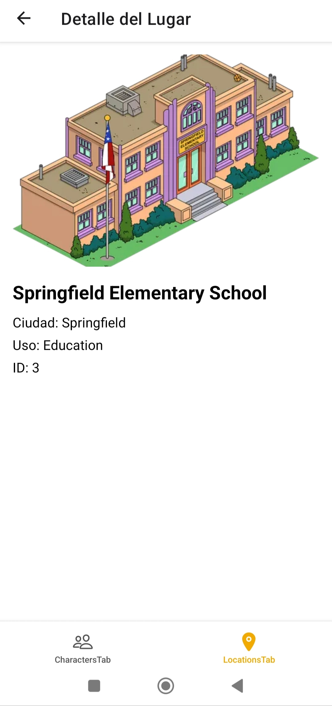 -->


<!-- 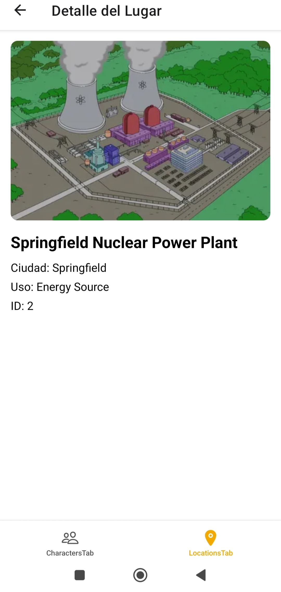 -->


# Salir de la Aplicación
<!-- 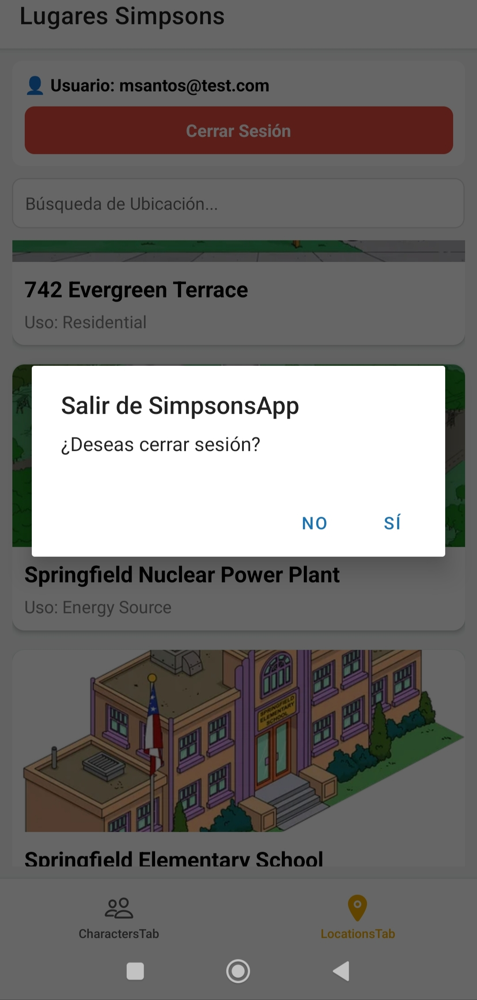 -->

